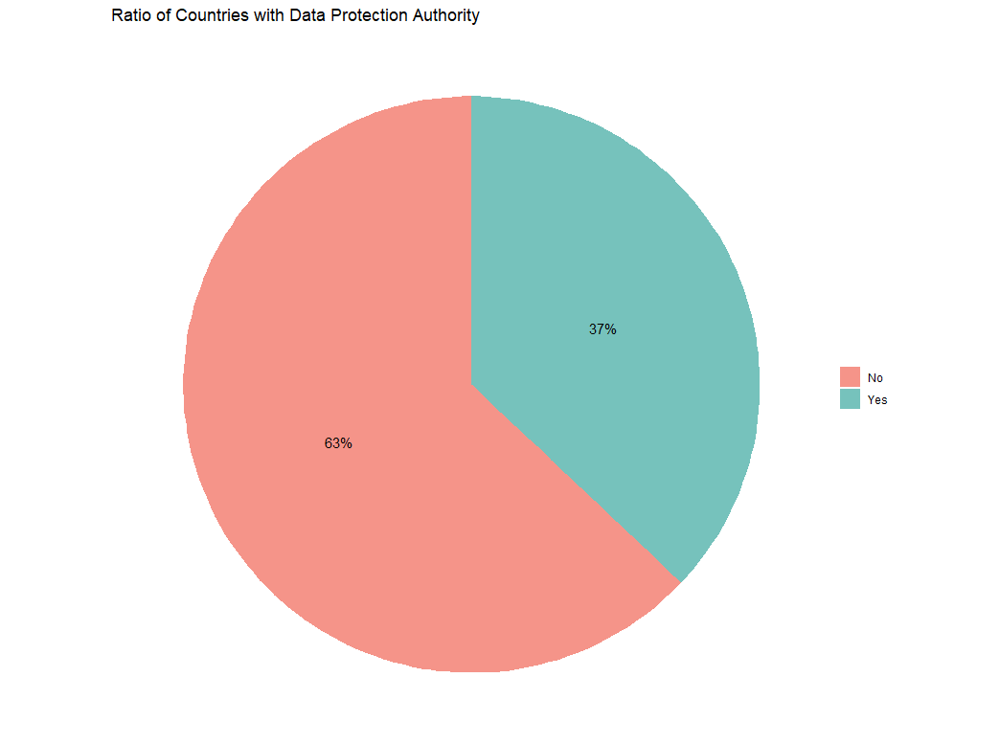
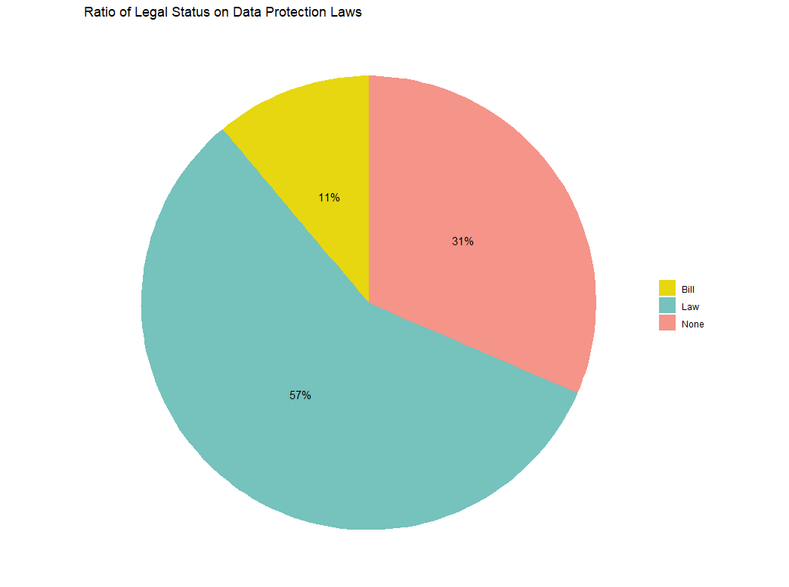
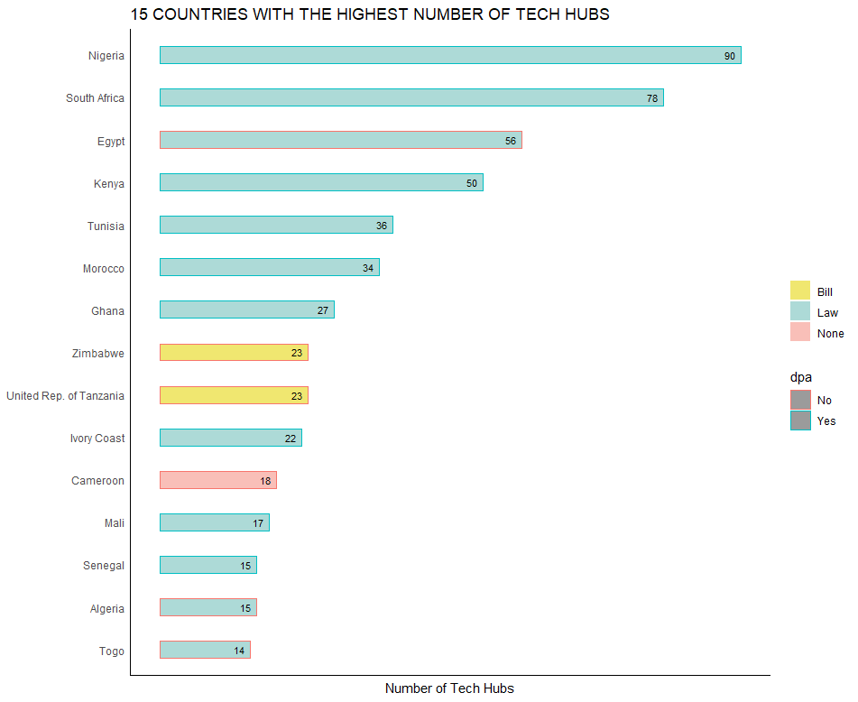
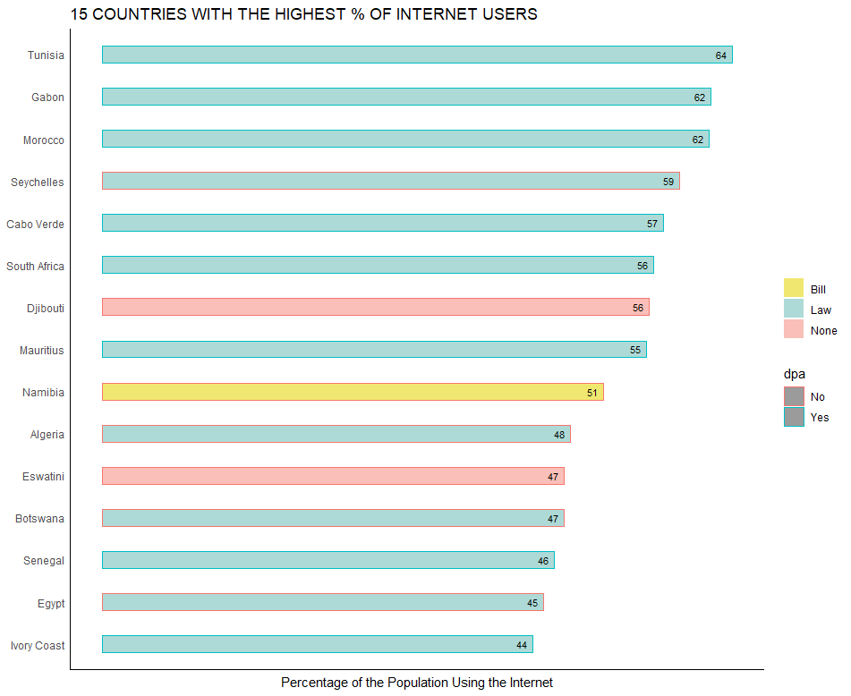
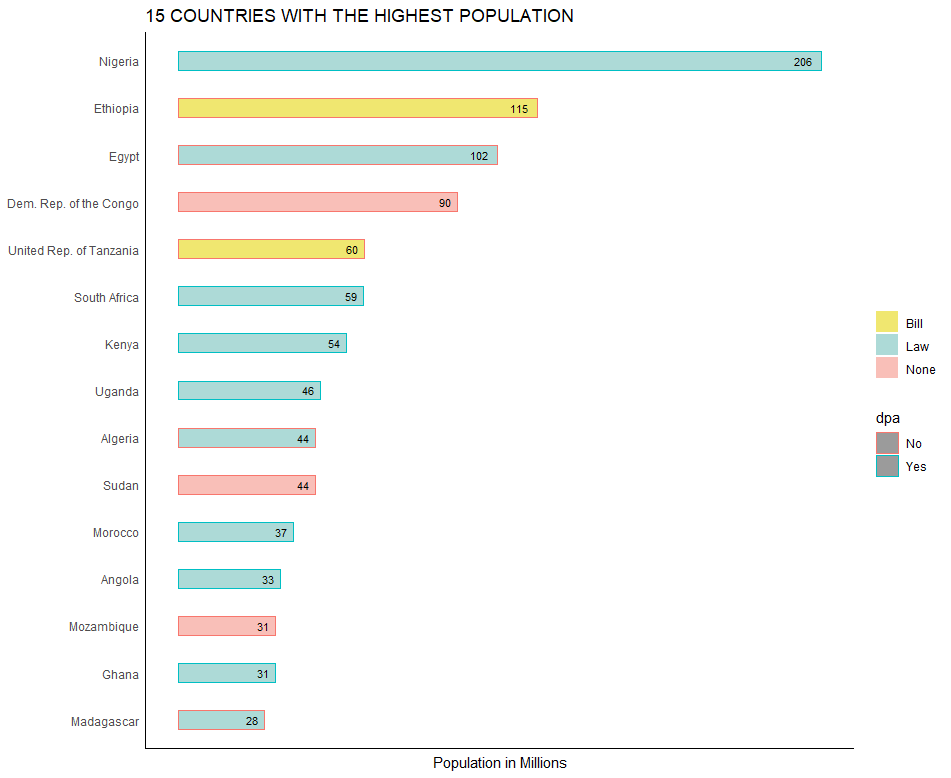
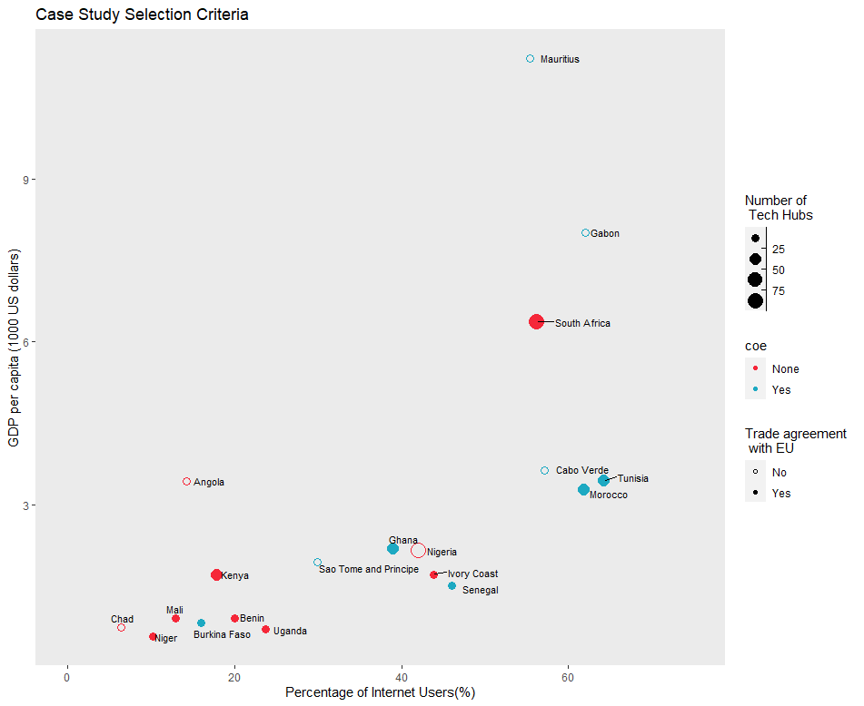

```{r setup, include=FALSE}
knitr::opts_chunk$set(collapse = TRUE)
```

The task was to mine for relevant data and presenting them in a manner that would simplify the decision making process in picking countries as case studies to assess the state and level of data protection regulation in Africa in order to;


- Get a deeper feel of the trends present among the countries; \n
-to find out which nations are to a more degree exposed to data mishandling;\n
- To find out which countries have strategies in place to safeguard their citizens' right of privacy,\n

>The following are some of the visuals that I had then created to facilitate the research paper.

 

     

