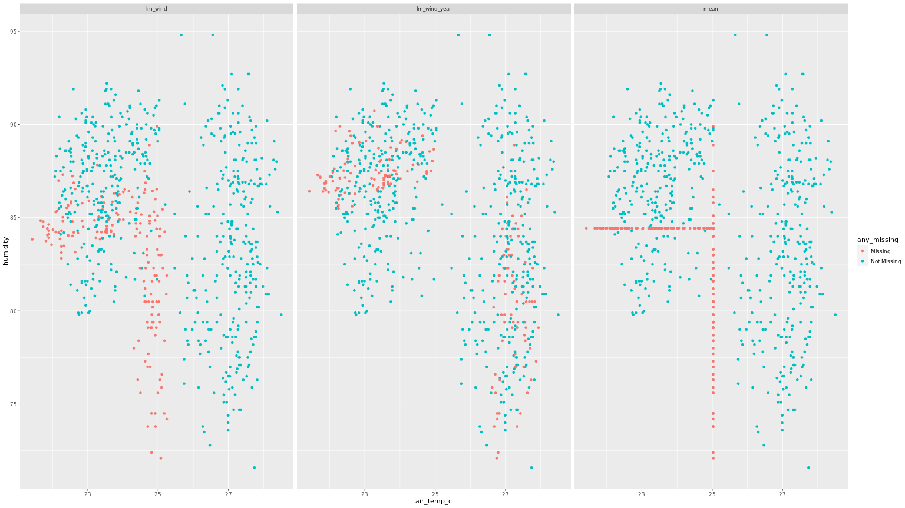

## Dealing with missing values :mag:

-   `any_na()` returns TRUE if any value is missing
-   `are_na()` returns a logical vector indicating missing values
-   `n_miss()` returns number of missing values
-   `prop_miss()` returns the proportion of the missing values
-   `prop_complete()` returns the proportion of the complete values
-   `pct_miss()` returns the percentage of missing values
-   `n_complete` returns the number of complete values

Note: -NULL,NaN and Inf values are not detected by these methods, only NA

-   NA \| TRUE = TRUE
-   NA \| FALSE = NA
-   NaN + NA = NaN
-   NA + NA = NA
-   NA + 1 = NA

`naniar` package holds functions to help us create dataframe summaries of the missing data

-   `miss_case_summary`, each case represents a row in a dataframe
-   `miss_var_summary` , each var represents a column, they work well with dplyrs
    `group_by()` function if you want to assess different groups in particular.
-   `miss_var_table`
-   `miss_case_table`
-   `miss_var_span` , helpful to segment the missing data summaries in regular interval
    spans in time-series data for instance where you might want to compare the data
    collection effeciency with respect to time span.
-   `miss_var_run`, returns the "runs"/"streaks" of missingness, particularly useful when
    trying to find repeated patterns of missing data. also can be paired well with dplyr's
    `group_by()` function
-   `miss_scan_count`, used for searching for oddly named missing values e.g. "N/A", "",
    "NOT AVAILABLE"... etc, then accompanied by a
-   `replace_with_na()`, `replace_with_na_at()`, `replace_with_na_if()`,
-   `replace_with_na_all()` functions to have all NAs 'uniform'.

### Visualization

-   `vis_miss` from `visdat` package for an overview
-   `gg_miss_var` can be faceted by one variable
-   `gg_miss_case`, order can be turned off by `order_cases = FALSE` argument, can be
    faceted by one variable
-   `gg_miss_fct`, can't be faceted, show trend of missing with factors
-   `gg_miss_run`
-   `gg_miss_upset` , vital in showing the number of
-   combinations of missing values that co-occur
-   `gg_miss_span` , supports faceting

## How to handle Implicitly missing data

Here we are dealing with missing data that is missing in the data (confusing, right?), in
other words, it turns the implicit missing variables into explicit missing variables. use
`tidyr`s `complete()` function, with the columns you want unique combinations of.

```{r remedy001,  tidy = 'styler'}

data %>% 
tidyr::complete(col1,col2)

```

-   another important function is the `fill()`, also from the `tidyr` package. last
    observation carried forward (LOCF).

## Missing Dependancies

1.  **MCAR** (Missing Completely at Random) \~the nissing data is 'randomly consistent' or
    'consistently random' and you cant describe its trend or cause -Imputation is
    advisable -Deleting missing observation may affect the sample size but will not
    introduce bias, usually only when less than \< 5% of data is missing

2.  **MAR** (Missing At Random) \~you can explain trends of the missing data usually
    explained by a trend of another variable -Imputation needs to be performed carefully
    -Deleting missing observations not advisable as it will lead or contribute to bias in
    your data, there's a insight in the missing variablees hence safer to impute.

3.  **MNAR** (Missing Not At Random) \~you know why your data is missing and usually
    depends on the the value of the missing variable, which makes this case complicated, a
    catch 22, if you will -Data will be biased from both deletion and imptutation
    -Inference can be limited, proceed with caution

### Visualization

-   using the function `shadow-bind()` we are able to create a nabular(NA + tabular)
    dataframe that is essential to spot trends associated with missing data, which can be
    combined with `dplyr()` functions to create powerful summaries

-   another important tool for visualizing the Missing dependancies is the
    `geom_miss_point()` geom from `ggplot2`, note that this method does an imputation in
    the background where it imputes the data 10% below minimum value

-   these two methods can be combined to bring fourth even more insight!!!

## Imputing data workflow

Just as imputing missing values is to our analysis, we need to also keep track of the
values that we have imputed, For this we will make use of the same `naniar` package that
we have utilized so far, we would also make use of the `dplyr` package to make statement
like

```{r remedy002, tidy = 'styler'}
`bind_shadow(data, only_miss = TRUE) %>% 
impute_below_all() %>% 
add_label_shadow()`

```

to create a data frame of imputed values below the variable range and mark each imputed
value in a subsequent identifier column

we can also make use of histograms from the `ggplot2` package to analyse the distribution
of missingness across each variable.

#### Things to keep track of

-   mean
-   median (boxplots)
-   spread (scatterplots)

NOTE: when we want to explore the missingness of more than two variables we would first
need to perform some data wrangling and reformat our data table into a longer version with
variables as values(gather/pivot_longer), this can be assisted with `naniar`s function
`shadow_long()` then combined with a histogram of the variable values grouped by their
missingness with a code similar to

```{r remedy003}
ggplot(data, aes(x = value, fill = value_NA)) + 
geom_histogram() + 
facet_wrap(~variable)`


```

## Performing imputations

Imputing the mean of the present variable is a common bad practise. As this artificially
increases the mean of your dataset and decreases the variance. And more likely than not,
the imputed values will not follow the pattern of the underlying data just similarily as
using the mean average of your data to predict future values.

We could use the same methods we use in creating models for prediction to fill in our
missing data. for instance the package `simputations` helps access various models for
imputation like the function `impute_lm()`would impute the missing values using a linear
model. inside this function we would specify the variable we would like to impute,

(var1) mapped against the variables we would like to inform the imputations (var2),
(var3), (var4) in the following form `var(1) ~ var(2) + var(3) + var(4)`

-The point outlined above subjects our data with variations of alternatives into building
our imputation model, as one may choose to define their model with 2 variables while on
might decide to use all four,So it would be wise to test the variations out and evaluate
the performance by seeing which model alters mean, median and spread the least and that
would be the model you implement. this can be done using the `bind_rows()` from `dplyr`
and comparing them with scatter plots

following is an example of what a plot of imputation comparisons would look like,

<center>



</center>

### Imputation model comparisons

to compare imputation models it is more practical to create the different sets of data
derived from different imputation models (including one version of the data with all the
missing values removed), creating linear models on the different set of data and
evaluating the how those models behave and pick the model you believe best represents your
data by exploring the coeffecients.

The process in R would look something like

```{r remedy004}

bound_models <- bind_rows(imp_model1 = imp_model1,
                          imp_model2 = imp_model2,
                          imp_model3 = imp_model3,
                          .id = "imp_model")

```

```{r}

model_summary <- bound_models %>% 
  group_by(imp_model) %>%
  nest() %>%
  mutate(mod = map(data, ~lm(var(1) ~ var(2) + var(3) + var(4), data = .)),
         res = map(mod, residuals),
         pred = map(mod, predict),
         tidy = map(mod, broom::tidy))

```

```{r remedy005}

 # Explore the coefficients in the model and select best model
model_summary %>% 
	select(imp_model ,tidy) %>% 
	unnest() `


```
