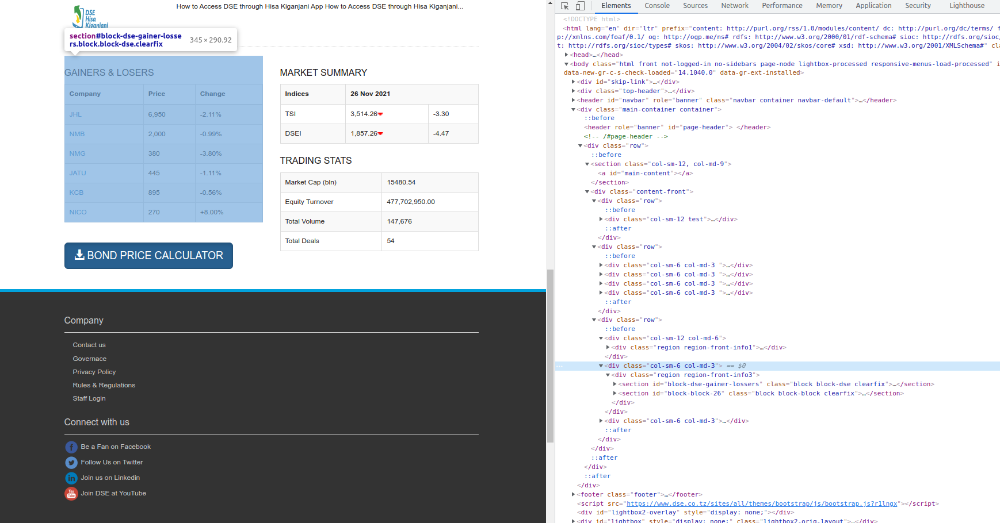

```{r setup, include=FALSE}
knitr::opts_chunk$set(fig.align = 'center', collapse = TRUE)
```

## Why Web Scrape?

If you are working in today's world, Many a times you would come across tasks where you need to find data published on a website, you finally find and it's all good.. except.. where is the download button?

Now, how frustrated I would usually get would depend on the amount of data to be copy&pasted or retyped, number of pages I have to click through, how many values I have to filter to find my required information, which is usually a lot.

But thanks to the data scraping tools and techniques available today, I was able to spice up my workflow by extracting the information required by selecting the data elements straight from the html page. An example of a scraping script to be demonstrated later in this article.

## Web Scraping Etiquette

A wise philosopher named Ben once said 

>"with great power comes great responsibility"

Well this relates to a lot of things and Data Scraping is no exception.

The following are three staples for scraping politeness;

1.  **Introduction**

    It is always a good idea to leave an introductory note in the `User-Agent` Field, the note should include your email and purpose of scraping. exaple below;

    ```{r}

    ```

2.  **Throttle your requests**

    As web scraping by code does not offer the natural buffer between requests to a website like one would do when retrieving the data manually, and while servers for websites like Wikipedia would likely not feel a thing. One can easily overload a server if the frequency of requests is not supported, especially when dealing with large amounts of data.

    ```{r}

    ```

3.  **Cite your source**

    Well this golden rule depends on the reason of scraping, It is always Imperative that we cite our data sources in any publication.

## Web Scraping Demonstration

Our sample target site is a website with [Dar es Salaam Stock Exchange data](https://www.dse.co.tz/).

Lets say we were trying to extract data from the table labelled `GAINERS & LOSERS`


by pressing `F12` we can inspect the html page elements so we know the identifiers of our table of interest.



1. Prepare Environment

<details>
<summary>Click for Code</summary>
```{r data, message=FALSE,warning=FALSE}
#setupenvironment------------------------------------------------------

library(rvest)
library(httr)
library(purrr)
library(dplyr)
library(ggplot2)
library(DT)


#loadthehtml-----------------------------------------------------------

response<-GET("https://www.dse.co.tz/")
html<-content(response)
status_code(response)

```
</details>


2. Extract Required Data

<details>
<summary>Click for Code</summary>
```{r extraction,warning=FALSE,message=FALSE}
#extractanycompanynames--------------------------------------------

company<-html%>%
html_nodes(xpath='//table//tr/td/a')%>%
html_text()

#extractPrice----------------------------------------------------

price<-html%>%
html_nodes(xpath='//table//tr/td[a]')%>%
html_nodes(xpath='..')%>%
html_nodes(xpath='td[position()=2]')%>%
html_text()

#Extractingchange-------------------------------------------------------

change<-html%>%
html_nodes(xpath='//table//tr/td[a]')%>%
html_nodes(xpath='..')%>%
html_nodes(xpath='td[position()=3]')%>%
html_text()

```
</details>


3. Creating Data frame

<details>
<summary>Click for Code</summary>
```{r dataframe}
#creatingdataframeforanalysis-----------------------------------------
gainers_losers<-data.frame(company=company,
price=price,
change=change)

```
</details>


4. Data Scrubbing

<details>
<summary>Click for Code</summary>
```{r scrub}
# clean data --------------------------------------------------------------
gainers_losers$company = as.factor(gainers_losers$company)
gainers_losers$price = as.numeric(gsub(",", "", gainers_losers$price))
gainers_losers$percent_change = as.numeric(gsub("%", "", gainers_losers$change))

gainers_losers <- gainers_losers %>% 
  mutate(pos = percent_change >= 0)

```
</details>


5. Analysis and Visualization

Let's take a glimpse at the data in a table

<details>
<summary>Click for Code</summary>
```{r, echo=TRUE, eval=FALSE}
datatable(gainers_losers)
```
</details>


```{r table, echo=FALSE}
datatable(gainers_losers)
```

Now that we have our data in a format that is convenient for analysis we can get to the fun part, exploration!


1. Sample Plot 1

<details>
<summary>Click for Code</summary>
```{r, echo=TRUE, eval=FALSE}
# visualization of the data -----------------------------------------------
ggplot(gainers_losers, aes(price, reorder(company,price))) + 
  geom_segment(aes(yend = company), 
               xend = 0,
               size = 7,
               color = "#46843B") + 
  geom_point(size = 6, 
             color = "#46843B") +
  scale_x_continuous("", limits = c(0,8000), position = "top") +
  geom_vline(xintercept = mean(gainers_losers$price), 
             linetype="longdash",
             color = "#A0512A", 
             size = 1.1) +
  theme_minimal() +
  theme(
    legend.position="none",
    axis.text = element_text(color = "black")
  )  +
  labs(title = "Price of Stock",
       subtitle = "- dashed line represents mean stock price for listed companies",
       caption = "Source: Dar es Salaam Stock Exchange PLC") +
  xlab("") +
  ylab("")
```
</details>


```{r fig1, echo=FALSE}
# visualization of the data -----------------------------------------------
ggplot(gainers_losers, aes(price, reorder(company,price))) + 
  geom_segment(aes(yend = company), 
               xend = 0,
               size = 7,
               color = "#46843B") + 
  geom_point(size = 6, 
             color = "#46843B") +
  scale_x_continuous("", limits = c(0,8000), position = "top") +
  geom_vline(xintercept = mean(gainers_losers$price), 
             linetype="longdash",
             color = "#A0512A", 
             size = 1.1) +
  theme_minimal() +
  theme(
    legend.position="none",
    axis.text = element_text(color = "black")
  )  +
  labs(title = "Price of Stock",
       subtitle = "- dashed line represents mean stock price for listed companies",
       caption = "Source: Dar es Salaam Stock Exchange PLC") +
  xlab("") +
  ylab("")
```


2. Sample Plot 2

<details>
<summary>Click for Code</summary>
```{r, echo=TRUE, eval=FALSE}
ggplot(gainers_losers, aes(as.factor(company), percent_change, fill = pos)) +
  geom_col(position = "identity", color = "black") +
  scale_fill_manual(values = c("#A0512A", "#46843B"), guide = FALSE) +
  theme_minimal() +
  theme(
    legend.position="none",
    axis.text = element_text(color = "black")
  )  +
  labs(title = "Percent Change in Stock Prices",
       caption = "Source: Dar es Salaam Stock Exchange PLC") +
  xlab("") +
  ylab("change in %")
```
</details>


```{r fig2, echo=FALSE}

ggplot(gainers_losers, aes(as.factor(company), percent_change, fill = pos)) +
  geom_col(position = "identity", color = "black") +
  scale_fill_manual(values = c("#A0512A", "#46843B"), guide = FALSE) +
  theme_minimal() +
  theme(
    legend.position="none",
    axis.text = element_text(color = "black")
  )  +
  labs(title = "Percent Change in Stock Prices",
       caption = "Source: Dar es Salaam Stock Exchange PLC") +
  xlab("") +
  ylab("change in %")

```
